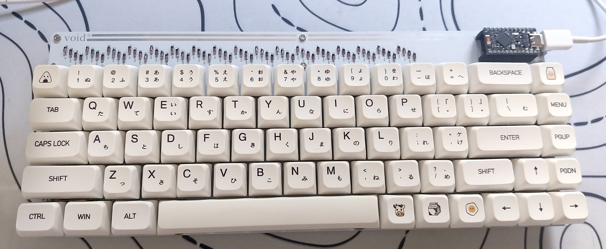

# ⌨️ voidPointer

The **voidPointer** is a 65% fully wireless keyboard, born from a love for the classic aesthetics of the [Discipline V2](https://github.com/coseyfannitutti/discipline), but redesigned from the ground up for a modern, cable-free setup.

It's a project that celebrates the beauty of exposed through-hole components and the freedom of Bluetooth connectivity with ZMK.

This is a WIP, so continue carefully. Also, I have changed the layout to only be ANSI because it creates various errors on KiCad with holes overlaping vias. Changing it back to ISO would require you to insert the missing switches and holes, and also routing these pads into the existing rows and columns.

---

## ✨ Main Features

- **100% Wireless:** Bluetooth Low Energy (BLE) connectivity with ZMK firmware.
- **Battery Efficiency:** Designed for months of use on a single charge (no LEDs).
- **nRF52840 Microcontroller:** Uses the `nice!nano v2` (or a compatible module) as its brain.
- **65% Layout:** A compact and popular layout, based on the Discipline.
- **THT (Through-Hole) Aesthetics:** Maintains the iconic design with visible `1N4148` diodes.
- **Hotswap (Optional):** The PCB is designed for soldering, but can be easily converted to hotswap using Mill-Max sockets (`7305` or `0305`).
- **Robust Firmware:** Runs the powerful [ZMK Firmware](https://zmk.dev/), enabling layers, macros, and multi-device support.

## 📖 About the Project

This project is a _remix_ and a tribute to the incredible work of **coseyfannitutti**. While the original Discipline is a masterpiece of wired design, the `voidPointer` adapts that philosophy to the wireless world.

The name `voidPointer` is a play on the C language, referencing a generic pointer that can point to "anything" — or, in this case, a pointer to nothing (void), celebrating the absence of wires.

## 🛠️ Technical Details and Components (BOM)

This is not an exhaustive list, but it covers the main components.

| Component                 | Quantity | Specification (Example)                                                                    |
| :------------------------ | :------- | :----------------------------------------------------------------------------------------- |
| **Custom PCB**            | 1        | `voidPointer` (Gerber files in the JLCPCB-supported format in the `/production` directory) |
| **Microcontroller**       | 1        | `nice!nano` v2 or `SuperMini nRF52840`                                                     |
| **Sockets for Micro**     | 2        | Male/Female Pin Headers (2x12) or Mill-Max Sockets                                         |
| **Diodes**                | ~68      | `1N4148` (Through-Hole THT)                                                                |
| **Power Switch**          | 1        | Slider Switch (ex: SS-12D00)                                                               |
| **Battery Connector**     | 1        | `JST-PH` 2-Pin (Horizontal)                                                                |
| **Capacitor (Filter)**    | 1        | `100nF` (0.1µF) - THT Ceramic (Ex: 104) or SMD (0805)                                      |
| **Capacitor (Reservoir)** | 1        | `10µF` - THT Ceramic or SMD (1206)                                                         |
| **Battery**               | 1        | LiPo (ex: 1200-2000mAh) with JST-PH connector                                              |
| **Switches**              | ~68      | MX-Style (3 or 5 pin)                                                                      |
| **Hotswap Sockets**       | ~136     | (Optional) Mill-Max `7305` or `0305`                                                       |
| **Stabilizers**           | 4        | PCB Mount (2u x3, 6.25u x1)                                                                |
| **Case Hardware**         | ~12      | M2 Screws and Standoffs                                                                    |

---

## ⚡ ZMK Firmware

This keyboard is designed for the [ZMK Firmware](https://zmk.dev/).

### My Config Repository

The firmware files (keymap, overlay, and config) for this project are not in this repository. They live in a separate repository, as is the ZMK standard.

➡️ **You can find my ZMK configuration here: [Config Repository](https://github.com/RafaelCasamaximo/VoidPointerFirmwareConfig)**

### How to Flash the Firmware

1.  Download the latest `.uf2` file from my config repository (in the "Actions" tab).
2.  Connect the microcontroller to the computer via USB.
3.  Press the **reset button** **twice quickly** (On the current version, this must be done by shorting the GND and RST pins on the micro).
4.  A "pen drive" (mass storage device) named `NICENANO` (or similar) will appear on your computer.
5.  **Drag and drop** the `.uf2` file onto this "pen drive".
6.  The device will automatically reboot with the new firmware.

---

## 🏗️ Assembly

1.  **Fabricate the PCB:** Upload the ZIP file from the `/production` directory to a PCB manufacturer (like JLCPCB, PCBWay, etc.).
2.  **PCB Assembly:**
    - **Soldering Order (IMPORTANT):** Solder components from the lowest to the highest profile.
    - 1. Diodes (Be careful with orientation! The black band must match the marking on the PCB).
    - 2. Capacitors, Power Switch, JST Connector.
    - 3. (Optional) Mill-Max Hotswap Sockets (Be patient!).
    - 4. Microcontroller Sockets.
    - 5. Install the Stabilizers.
3.  **Final Assembly:**
    - Fit the plate.
    - Insert the switches (if hotswap) or solder them (if solder).
    - Assemble the case sandwich with the screws and standoffs.
    - Connect the battery.
    - Fit the microcontroller into its sockets.
    - Put on the keycaps.

## Acknowledgements

- This project is a direct derivative of the **Discipline** and owes all its credit to **[coseyfannitutti](https://github.com/coseyfannitutti)**.
- To the entire **ZMK Firmware** team and community.

## License

Creative Commons Attribution-NonCommercial 4.0 International License
